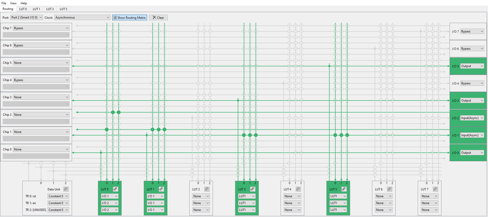
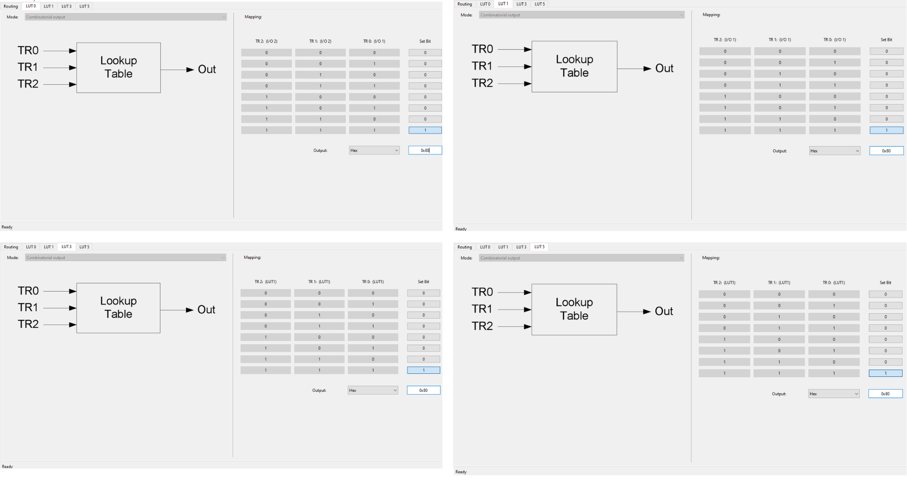

# PSOC&trade; 4: Clock buffer with smart I/O

This example shows how to use a smart I/O peripheral in PSOC&trade; 4 device to implement a clock buffer that can operate in chip low-power modes. It can also be used to drive a heavier load than one GPIO is rated for by replicating the signal and driving two pins.

[View this README on GitHub.](https://github.com/Infineon/mtb-example-psoc4-clock-buffer-with-smart-io)

[Provide feedback on this code example.](https://cypress.co1.qualtrics.com/jfe/form/SV_1NTns53sK2yiljn?Q_EED=eyJVbmlxdWUgRG9jIElkIjoiQ0UyMzY3MTMiLCJTcGVjIE51bWJlciI6IjAwMi0zNjcxMyIsIkRvYyBUaXRsZSI6IlBTT0MmdHJhZGU7IDQ6IENsb2NrIGJ1ZmZlciB3aXRoIHNtYXJ0IEkvTyIsInJpZCI6InJhamFubmFnYXV0YSIsIkRvYyB2ZXJzaW9uIjoiMS4zLjAiLCJEb2MgTGFuZ3VhZ2UiOiJFbmdsaXNoIiwiRG9jIERpdmlzaW9uIjoiTUNEIiwiRG9jIEJVIjoiSUNXIiwiRG9jIEZhbWlseSI6IlBTT0MifQ==)

## Requirements

- [ModusToolbox&trade;](https://www.infineon.com/modustoolbox) v3.4 or later (tested with v3.4)
- Board support package (BSP) minimum required version: 3.1.0
- Programming language: C
- Associated parts: [PSOC&trade; 4000S, PSOC&trade; 4100S Plus, PSOC&trade; 4100S Max, PSOC&trade; 4500S](https://www.infineon.com/cms/en/product/microcontroller/32-bit-psoc-arm-cortex-microcontroller/psoc-4-32-bit-arm-cortex-m0-mcu/) and [ PSOC&trade; 4 HV (High Voltage)](https://www.infineon.com/cms/en/product/microcontroller/32-bit-psoc-arm-cortex-microcontroller/32-bit-psoc-4-hv-arm-cortex-m0/)


## Supported toolchains (make variable 'TOOLCHAIN')

- GNU Arm&reg; Embedded Compiler v11.3.1 (`GCC_ARM`) - Default value of `TOOLCHAIN`
- Arm&reg; Compiler v6.16 (`ARM`)
- IAR C/C++ Compiler v9.40.2 (`IAR`)

## Supported kits (make variable 'TARGET')

- [PSOC&trade; 4100S Max Pioneer Kit](https://www.infineon.com/CY8CKIT-041S-MAX) (`CY8CKIT-041S-MAX`) – Default value of `TARGET`
- [PSOC&trade; 4100S Plus Prototyping Kit](https://www.infineon.com/CY8CKIT-149) (`CY8CKIT-149`)
- [PSOC&trade; 4000S CAPSENSE&trade; Prototyping Kit](https://www.infineon.com/CY8CKIT-145-40XX) (`CY8CKIT-145-40XX`)
- [PSOC&trade; 4500S Pioneer Kit](https://www.infineon.com/CY8CKIT-045S) (`CY8CKIT-045S`)
- [PSOC&trade; 4 HVMS-128K Evaluation Kit](https://www.infineon.com/KIT_PSoC4-HVMS-128K_LITE) (`KIT_PSoC4-HVMS-128K_LITE`)
- [PSOC&trade; 4 HVMS-64K Evaluation Kit](https://www.infineon.com/KIT_PSoC4-HVMS-64K_LITE) (`KIT_PSoC4-HVMS-64K_LITE`)

## Hardware setup

1. Connect IN_PIN to a square wave source (e.g. from a signal generator) that is less than 1 MHz and to an oscilloscope.
2. Connect OUT_PIN_0 and OUT_PIN_1 to an oscilloscope.
3. Connect TRIG_PIN to GND (Alternatively use an external active high switch).

For all the four kits ([CY8CKIT-41S-MAX](https://www.infineon.com/CY8CKIT-041S-MAX),[CY8CKIT-149](https://www.infineon.com/CY8CKIT-149),[CY8CKIT-145-40XX](https://www.infineon.com/CY8CKIT-145-40XX), and [CY8CKIT-045S](https://www.infineon.com/CY8CKIT-045S)) smart I/O uses port 2.

**Table 1. Smart I/O pin connections**
Pin Name | Resource
 :------- | :------------
IN_PIN | P2[1] 
TRIG_PIN | P2[2] 
OUT_PIN_0 | P2[3] 
OUT_PIN_1 | P2[5]

- For [CY8CKIT-045S](https://www.infineon.com/CY8CKIT-045S) OUT_PIN_1 is configured to P2[6].

> **Note:** Some of the PSOC&trade; 4 kits ship with KitProg2 installed. The ModusToolbox&trade; software requires KitProg3. Before using this code example, make sure that the board is upgraded to KitProg3. The tool and instructions are available in the [Firmware Loader](https://github.com/Infineon/Firmware-loader) GitHub repository. If you do not upgrade, you will see an error like "unable to find CMSIS-DAP device" or "KitProg firmware is out of date".

## Software setup

The smart I/O peripheral is a port-wide resource; you must define its port before it can be used.

Default port is Port 2 for [CY8CKIT-041S-MAX](https://www.infineon.com/CY8CKIT-041S-MAX), [CY8CKIT-149](https://www.infineon.com/CY8CKIT-149), [CY8CKIT-145-40XX](https://www.infineon.com/CY8CKIT-145-40XX), and [CY8CKIT-045S](https://www.infineon.com/CY8CKIT-045S).

**Table 2. STATUS_PIN resource connection**

Pin Name | [CY8CKIT-41S-MAX](https://www.infineon.com/CY8CKIT-041S-MAX) | [CY8CKIT-149](https://www.infineon.com/CY8CKIT-149) | [CY8CKIT-145-40XX](https://www.infineon.com/CY8CKIT-145-40XX) | [CY8CKIT-045S](https://www.infineon.com/CY8CKIT-045S)
 :------- | :------------    | :------------ | :---------- | :--------------
STATUS_PIN | P7[3] | P1[4] | P3[6] | P1[6]

> **Note:** STATUS_PIN is connected to LED.

## Using the code example

### Create the project

The ModusToolbox&trade; tools package provides the Project Creator as both a GUI tool and a command line tool.

<details><summary><b>Use Project Creator GUI</b></summary>

1. Open the Project Creator GUI tool.

   There are several ways to do this, including launching it from the dashboard or from inside the Eclipse IDE. For more details, see the [Project Creator user guide](https://www.infineon.com/ModusToolboxProjectCreator) (locally available at *{ModusToolbox&trade; install directory}/tools_{version}/project-creator/docs/project-creator.pdf*).

2. On the **Choose Board Support Package (BSP)** page, select a kit supported by this code example. See [Supported kits](#supported-kits-make-variable-target).
   > **Note:** To use this code example for a kit not listed here, you may need to update the source files. If the kit does not have the required resources, the application may not work.

3. On the **Select Application** page:

   a. Select the **Applications(s) Root Path** and the **Target IDE**.

   > **Note:** Depending on how you open the Project Creator tool, these fields may be pre-selected for you.

   b.	Select this code example from the list by enabling its check box.

   > **Note:** You can narrow the list of displayed examples by typing in the filter box.

   c. (Optional) Change the suggested **New Application Name** and **New BSP Name**.

   d. Click **Create** to complete the application creation process.

</details>

<details><summary><b>Use Project Creator CLI</b></summary>

The 'project-creator-cli' tool can be used to create applications from a CLI terminal or from within batch files or shell scripts. This tool is available in the *{ModusToolbox&trade; install directory}/tools_{version}/project-creator/* directory.

Use a CLI terminal to invoke the 'project-creator-cli' tool. On Windows, use the command-line 'modus-shell' program provided in the ModusToolbox&trade; installation instead of a standard Windows command-line application. This shell provides access to all ModusToolbox&trade; tools. You can access it by typing "modus-shell" in the search box in the Windows menu. In Linux and macOS, you can use any terminal application.

The following example clones the "mtb-example-psoc4-clock-buffer-with-smart-io" application with the desired name "ClockBufferSmartIO" configured for the CY8CKIT-041S-MAX BSP into the specified working directory, C:/mtb_projects:

   ```
   project-creator-cli --board-id CY8CKIT-041S-MAX --app-id mtb-example-psoc4-clock-buffer-with-smart-io --user-app-name ClockBufferSmartIO --target-dir "C:/mtb_projects"
   ```

The 'project-creator-cli' tool has the following arguments:

Argument | Description | Required/optional
---------|-------------|-----------
`--board-id` | Defined in the <id> field of the [BSP](https://github.com/Infineon?q=bsp-manifest&type=&language=&sort=) manifest | Required
`--app-id`   | Defined in the <id> field of the [CE](https://github.com/Infineon?q=ce-manifest&type=&language=&sort=) manifest | Required
`--target-dir`| Specify the directory in which the application is to be created if you prefer not to use the default current working directory | Optional
`--user-app-name`| Specify the name of the application if you prefer to have a name other than the example's default name | Optional

> **Note:** The project-creator-cli tool uses the `git clone` and `make getlibs` commands to fetch the repository and import the required libraries. For details, see the "Project creator tools" section of the [ModusToolbox&trade; tools package user guide](https://www.infineon.com/ModusToolboxUserGuide) (locally available at {ModusToolbox&trade; install directory}/docs_{version}/mtb_user_guide.pdf).


</details>

### Open the project

After the project has been created, you can open it in your preferred development environment.

<details><summary><b>Eclipse IDE</b></summary>


If you opened the Project Creator tool from the included Eclipse IDE, the project will open in Eclipse automatically.

For more details, see the [Eclipse IDE for ModusToolbox&trade; user guide](https://www.infineon.com/MTBEclipseIDEUserGuide) (locally available at *{ModusToolbox&trade; install directory}/docs_{version}/mt_ide_user_guide.pdf*).

</details>


<details><summary><b>Visual Studio (VS) Code</b></summary>

Launch VS Code manually, and then open the generated *{project-name}.code-workspace* file located in the project directory.

For more details, see the [Visual Studio Code for ModusToolbox&trade; user guide](https://www.infineon.com/MTBVSCodeUserGuide) (locally available at *{ModusToolbox&trade; install directory}/docs_{version}/mt_vscode_user_guide.pdf*).

</details>


<details><summary><b>Keil µVision</b></summary>

Double-click the generated *{project-name}.cprj* file to launch the Keil µVision IDE.

For more details, see the [Keil µVision for ModusToolbox&trade; user guide](https://www.infineon.com/MTBuVisionUserGuide) (locally available at *{ModusToolbox&trade; install directory}/docs_{version}/mt_uvision_user_guide.pdf*).

</details>

<details><summary><b>IAR Embedded Workbench</b></summary>

Open IAR Embedded Workbench manually, and create a new project. Then select the generated *{project-name}.ipcf* file located in the project directory.

For more details, see the [IAR Embedded Workbench for ModusToolbox&trade; user guide](https://www.infineon.com/MTBIARUserGuide) (locally available at *{ModusToolbox&trade; install directory}/docs_{version}/mt_iar_user_guide.pdf*).

</details>

<details><summary><b>Command line</b></summary>


If you prefer to use the CLI, open the appropriate terminal, and navigate to the project directory. On Windows, use the command-line 'modus-shell' program; on Linux and macOS, you can use any terminal application. From there, you can run various `make` commands.

For more details, see the [ModusToolbox&trade; tools package user guide](https://www.infineon.com/ModusToolboxUserGuide) (locally available at *{ModusToolbox&trade; install directory}/docs_{version}/mtb_user_guide.pdf*).

</details>


## Operation

1. Connect the board to your PC using the provided USB cable through the KitProg3 USB connector.

2. Program the board using one of the following:

   <details><summary><b>Using Eclipse IDE</b></summary>

      1. Select the application project in the Project Explorer.

      2. In the **Quick Panel**, scroll down, and click **\<Application Name> Program (KitProg3_MiniProg4)**.

   </details>

   <details><summary><b>In other IDEs</b></summary>

   Follow the instructions in your preferred IDE.
   </details>


   <details><summary><b>Using CLI</b></summary>

     From the terminal, execute the `make program` command to build and program the application using the default toolchain to the default target. The default toolchain is specified in the application's Makefile but you can override this value manually:
      ```
      make program TOOLCHAIN=<toolchain>
      ```

      Example:
      ```
      make program TOOLCHAIN=GCC_ARM
      ```
   </details>


3. After programming, observe that the signal going into IN_PIN is replicated on OUT_PIN_0 and OUT_PIN_1. These are operational during deep-sleep mode; the two signals can be externally ganged to drive a higher load.

4. Connect TRIG_PIN to VDD and then connect it back to GND. Alternatively push the external active high switch connected to TRIG_PIN. Observe that the LED connected to STATUS_PIN lights up for approximately 1 second. Observe that the OUT_PIN_0 and OUT_PIN_1 continue to operate regardless of chip power mode.

## Debugging

You can debug the example to step through the code.

<details><summary><b>In Eclipse IDE</b></summary>

Use the **\<Application Name> Debug (KitProg3_MiniProg4)** configuration in the **Quick Panel**. For details, see the "Program and debug" section in the [Eclipse IDE for ModusToolbox&trade; user guide](https://www.infineon.com/MTBEclipseIDEUserGuide).

</details>


<details><summary><b>In other IDEs</b></summary>

Follow the instructions in your preferred IDE.
</details>

> **Note:** As the program enters the deepsleep mode debugging will not work as desired. As debug connection will be interrupted.

## Design and implementation

The design consists of a smart I/O peripheral with only the pins on the port as its inputs and outputs. It does not use any peripherals or internal chip signals. The peripheral performs a signal replication function by taking in an external signal (such as an external clock) and driving it out to two pins. This effectively implements a signal buffer functionality. The two pins can then be ganged externally to the chip to drive a load that is higher than rated for a single GPIO pin.

The smart I/O peripheral is operational during the device’s deep-sleep mode. This design shows how multiple signals can be used in the smart I/O peripheral to trigger an interrupt that is the result of a logical operation on those signals.

For the clock buffer, an external signal is input through I/O 1, which in turn is connected to IN_PIN. This signal is repeated and output to I/O 3 and I/O 5. These are connected to OUT_PIN_0 and OUT_PIN_1 respectively.

For interrupt generation, the peripheral accepts a digital input signal through I/O 2, which is connected to TRIG_PIN. This signal is logically ANDed with I/O 1 by using LUT0. The result is output to I/O 0, triggers the GPIO interrupt on INTR_PIN. The INTR_PIN is configured to generate a GPIO interrupt on a rising edge signal. A digital output STATUS_PIN is used to signal the LED via firmware for device wakeup indication.

The firmware is implemented in *main.c* and performs the following functions:

1. Initialize and enable GPIO interrupt
2. Starts the smart I/O peripheral
3. Device enters deep sleep mode
4. When the interrupt is triggered, the device wakes up and drives the STATUS_PIN high for 1 second
5. STATUS_PIN is driven LOW; device re-enters deep sleep

> **Note:** This code example is designed for the specified ports on the stated devices. The design is portable to other PSOC&trade; 4 devices with smart I/O, but it may require LUT reconfiguration due to the close relationship between the device port and the peripheral.

### Resources and settings

**Table 3. Application resources**

 Resource  |  Alias/object     |    Purpose
 :------- | :------------    | :------------
 SmartIO |SMART_IO|Perform simple logic operations on peripheral and GPIO signals at the GPIO port
Pins | OUT_PIN_0, OUT_PIN_1, INTR_PIN, IN_PIN, TRIG_PIN, STATUS_PIN | GPIO Signals
Interrupt|switch_isr|Switch interrupt

#### Parameter Settings

The smart I/O peripheral is configured in "Asynchronous mode".

**Figure 1: Smart I/O routing configuration**



Figure 2 shows the LUT configurations. Only combinatorial elements are used; the block is operational in chip deep sleep mode.
LUT0 accepts I/O 1 and I/O 2 as inputs. The LUT configuration performs a logical AND of these signals and outputs the result to I/O 0. This is used to trigger the wakeup event on the GPIO.
LUT1 is configured to repeat the I/O 1 signal. Its output is fed to LUT3 and LUT5. Note that that there are two reasons why two LUTs are used per path (LUT1->LUT3 and LUT1->LUT5):

1. LUT4 to LUT7 cannot accept I/O [3:0] or chip [3:0] as inputs. An intermediary LUT must be used.

2. LUT3 can directly accept I/O 1 as input but LUT5 cannot. If the design requires that the signals appearing in I/O 3 and I/O 5 must be in sync, an intermediary LUT should be used to minimize path delay difference.

LUT3 and LUT5 are configured to repeat the LUT1 output signal. These are then output through I/O 3 and I/O 5 respectively.

> **Note:** For [CY8CKIT-045S](https://www.infineon.com/CY8CKIT-045S), pin P2[6] is used instead of P2[5], hence LUT6 is configured instead of LUT5.

**Figure 2. Smart I/O LUT configuration**



<br>

## Related resources

Resources  | Links
-----------|----------------------------------
Application notes  | [AN79953](https://www.infineon.com/AN79953) – Getting started with PSOC&trade; 4
Code examples | [Using ModusToolbox&trade; software](https://github.com/Infineon/Code-Examples-for-ModusToolbox-Software) on GitHub <br> [Using PSOC&trade; Creator](https://www.infineon.com/cms/en/design-support/software/code-examples/psoc-3-4-5-code-examples-for-psoc-creator/)
Device documentation | Download datasheets, TRMs, and other documents from the [PSOC&trade; 4 product page](https://www.infineon.com/cms/en/product/microcontroller/32-bit-psoc-arm-cortex-microcontroller/psoc-4-32-bit-arm-cortex-m0-mcu)
Development kits | Select your kits from the [Evaluation board finder](https://www.infineon.com/cms/en/design-support/finder-selection-tools/product-finder/evaluation-board) page.
Libraries on GitHub | [mtb-pdl-cat2](https://github.com/Infineon/mtb-pdl-cat2) – PSOC&trade; 4 peripheral driver library (PDL)<br> [mtb-hal-cat2](https://github.com/Infineon/mtb-hal-cat2) – Hardware abstraction layer (HAL) library <br>
Tools  | [ModusToolbox&trade; software](https://www.infineon.com/modustoolbox) – ModusToolbox&trade; software is a collection of easy-to-use software and tools enabling rapid development with Infineon MCUs, covering applications from embedded sense and control to wireless and cloud-connected systems using AIROC&trade; Wi-Fi and Bluetooth® connectivity devices. <br> [PSOC&trade; Creator](https://www.infineon.com/cms/en/design-support/tools/sdk/psoc-software/psoc-creator/) – IDE for PSOC&trade; and FM0+ MCU development

<br>


## Other resources

Infineon provides a wealth of data at www.infineon.com to help you select the right device, and quickly and effectively integrate it into your design.

## Document history

Document title: *CE236713* – *PSOC&trade; 4: Clock buffer with smart I/O*

 Version | Description of change
 ------- | ---------------------
 1.0.0   | New code example
 1.1.0   | Added support for CY8CKIT-045S and updated to support ModusToolbox&trade; v3.1
 1.2.0   | Added support for KIT_PSoC4-HVMS-128K_LITE and KIT_PSoC4-HVMS-64K_LITE and updated to support ModusToolbox&trade; v3.2.
 1.3.0   | Changed PSoC HV MS kit name to PSOC4 and updated to support ModusToolbox&trade; v3.4.
<br>

---------------------------------------------------------

© Cypress Semiconductor Corporation, 2024. This document is the property of Cypress Semiconductor Corporation, an Infineon Technologies company, and its affiliates ("Cypress").  This document, including any software or firmware included or referenced in this document ("Software"), is owned by Cypress under the intellectual property laws and treaties of the United States and other countries worldwide.  Cypress reserves all rights under such laws and treaties and does not, except as specifically stated in this paragraph, grant any license under its patents, copyrights, trademarks, or other intellectual property rights.  If the Software is not accompanied by a license agreement and you do not otherwise have a written agreement with Cypress governing the use of the Software, then Cypress hereby grants you a personal, non-exclusive, nontransferable license (without the right to sublicense) (1) under its copyright rights in the Software (a) for Software provided in source code form, to modify and reproduce the Software solely for use with Cypress hardware products, only internally within your organization, and (b) to distribute the Software in binary code form externally to end users (either directly or indirectly through resellers and distributors), solely for use on Cypress hardware product units, and (2) under those claims of Cypress’s patents that are infringed by the Software (as provided by Cypress, unmodified) to make, use, distribute, and import the Software solely for use with Cypress hardware products.  Any other use, reproduction, modification, translation, or compilation of the Software is prohibited.
<br>
TO THE EXTENT PERMITTED BY APPLICABLE LAW, CYPRESS MAKES NO WARRANTY OF ANY KIND, EXPRESS OR IMPLIED, WITH REGARD TO THIS DOCUMENT OR ANY SOFTWARE OR ACCOMPANYING HARDWARE, INCLUDING, BUT NOT LIMITED TO, THE IMPLIED WARRANTIES OF MERCHANTABILITY AND FITNESS FOR A PARTICULAR PURPOSE.  No computing device can be absolutely secure.  Therefore, despite security measures implemented in Cypress hardware or software products, Cypress shall have no liability arising out of any security breach, such as unauthorized access to or use of a Cypress product. CYPRESS DOES NOT REPRESENT, WARRANT, OR GUARANTEE THAT CYPRESS PRODUCTS, OR SYSTEMS CREATED USING CYPRESS PRODUCTS, WILL BE FREE FROM CORRUPTION, ATTACK, VIRUSES, INTERFERENCE, HACKING, DATA LOSS OR THEFT, OR OTHER SECURITY INTRUSION (collectively, "Security Breach").  Cypress disclaims any liability relating to any Security Breach, and you shall and hereby do release Cypress from any claim, damage, or other liability arising from any Security Breach.  In addition, the products described in these materials may contain design defects or errors known as errata which may cause the product to deviate from published specifications. To the extent permitted by applicable law, Cypress reserves the right to make changes to this document without further notice. Cypress does not assume any liability arising out of the application or use of any product or circuit described in this document. Any information provided in this document, including any sample design information or programming code, is provided only for reference purposes.  It is the responsibility of the user of this document to properly design, program, and test the functionality and safety of any application made of this information and any resulting product.  "High-Risk Device" means any device or system whose failure could cause personal injury, death, or property damage.  Examples of High-Risk Devices are weapons, nuclear installations, surgical implants, and other medical devices.  "Critical Component" means any component of a High-Risk Device whose failure to perform can be reasonably expected to cause, directly or indirectly, the failure of the High-Risk Device, or to affect its safety or effectiveness.  Cypress is not liable, in whole or in part, and you shall and hereby do release Cypress from any claim, damage, or other liability arising from any use of a Cypress product as a Critical Component in a High-Risk Device. You shall indemnify and hold Cypress, including its affiliates, and its directors, officers, employees, agents, distributors, and assigns harmless from and against all claims, costs, damages, and expenses, arising out of any claim, including claims for product liability, personal injury or death, or property damage arising from any use of a Cypress product as a Critical Component in a High-Risk Device. Cypress products are not intended or authorized for use as a Critical Component in any High-Risk Device except to the limited extent that (i) Cypress’s published data sheet for the product explicitly states Cypress has qualified the product for use in a specific High-Risk Device, or (ii) Cypress has given you advance written authorization to use the product as a Critical Component in the specific High-Risk Device and you have signed a separate indemnification agreement.
<br>
Cypress, the Cypress logo, and combinations thereof, WICED, ModusToolbox, PSoC, CapSense, EZ-USB, F-RAM, and Traveo are trademarks or registered trademarks of Cypress or a subsidiary of Cypress in the United States or in other countries. For a more complete list of Cypress trademarks, visit www.infineon.com. Other names and brands may be claimed as property of their respective owners.
